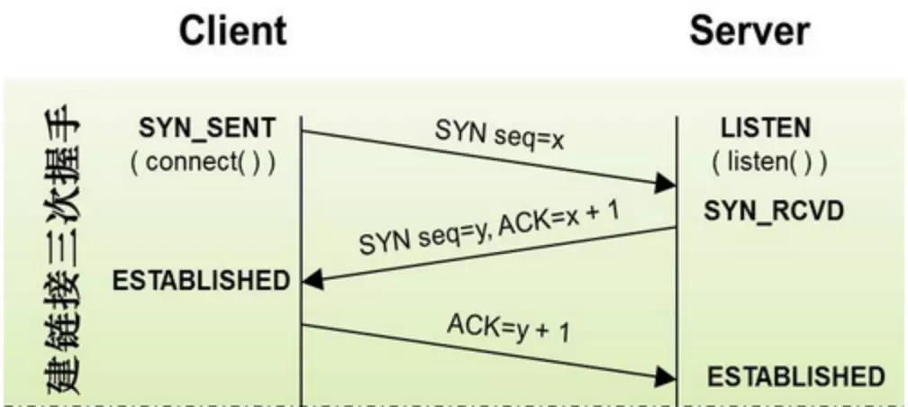
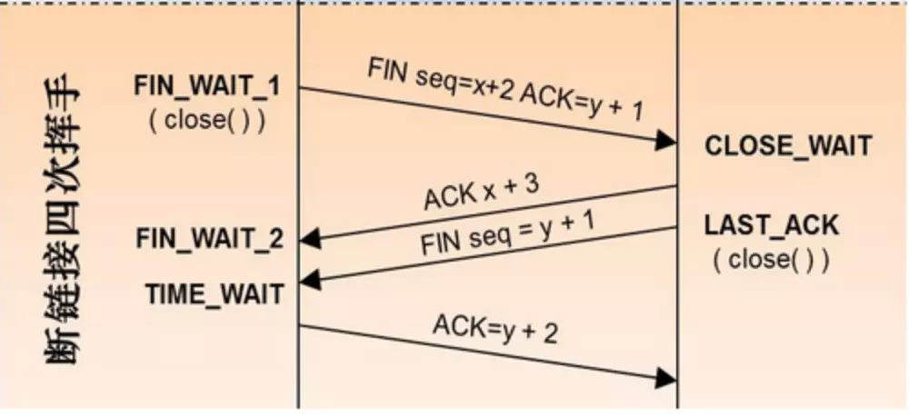

<!-- toc -->  
## HTTP  
### 状态码   
+ 1xx 临时响应（服务端响应，并等待中）   
+ 2xx 成功   
+ 3xx 重定向   
+ 4xx 请求错误（web服务器错误）   
+ 5xx 服务器错误  

参考：https://blog.csdn.net/u014346301/article/details/53995333    
### HTTP1、HTTPS版本区别<b style="color:#52ea5f;">[安全点]</b>  
  https是基于ssl加密的http协议  
### HTTP1、HTTP2版本区别<b style="color:#52ea5f;">[优化点]</b>    
  + HTTP2压缩消息头，减少带宽，提高传输速率    
  + 允许多路复用    
    HTTP1.1:    
    &nbsp;浏览器客户端在同一时间，针对同一域名下的请求有一定数量限制（连接数量），超过限制会被阻塞   
    HTTP2:    
    &nbsp;允许同时通过单一的HTTP/2连接发送多重请求-响应信息      
  + 二进制分帧   
    &nbsp;将所有的传输信息分割为更小的信息或者帧，并对他们进行二进制编码  

### 浏览器访问页面过程  
#### 步骤 ：  
+ DNS 解析:将域名解析成 IP 地址  
+ TCP 连接：TCP 三次握手  
+ 发送 HTTP 请求  
+ 服务器处理请求并返回 HTTP 报文  
+ 浏览器解析渲染页面  
+ 断开连接：TCP 四次挥手  

#### 详解 ：  
+ TCP 三次握手  
    

客户端发送一个带 SYN=1，Seq=X 的数据包到服务器端口（第一次握手，由浏览器发起，告诉服务器我要发送请求了）  

服务器发回一个带 SYN=1， ACK=X+1， Seq=Y 的响应包以示传达确认信息（第二次握手，由服务器发起，告诉浏览器我准备接受了，你赶紧发送吧）  

客户端再回传一个带 ACK=Y+1， Seq=Z 的数据包，代表“握手结束”（第三次握手，由浏览器发送，告诉服务器，我马上就发了，准备接受吧）  

+ 浏览器解析渲染页面  
  + 浏览器内核拿到内容后，渲染步骤如下：  
  1. 解析HTML，构建DOM树  
  2. 解析CSS，生成CSS规则树  
  3. 合并DOM树和CSS规则，生成render树  
  4. 布局render树（Layout/reflow，布局/回流），负责各元素尺寸、位置的计算  
  5. 绘制render树（paint），绘制页面像素信息    

  注意：  
    + 布局/回流，早于绘制  

+ TCP四次挥手  
   

参考：  
https://juejin.im/post/5c7646f26fb9a049fd108380  
<!-- endtoc -->  