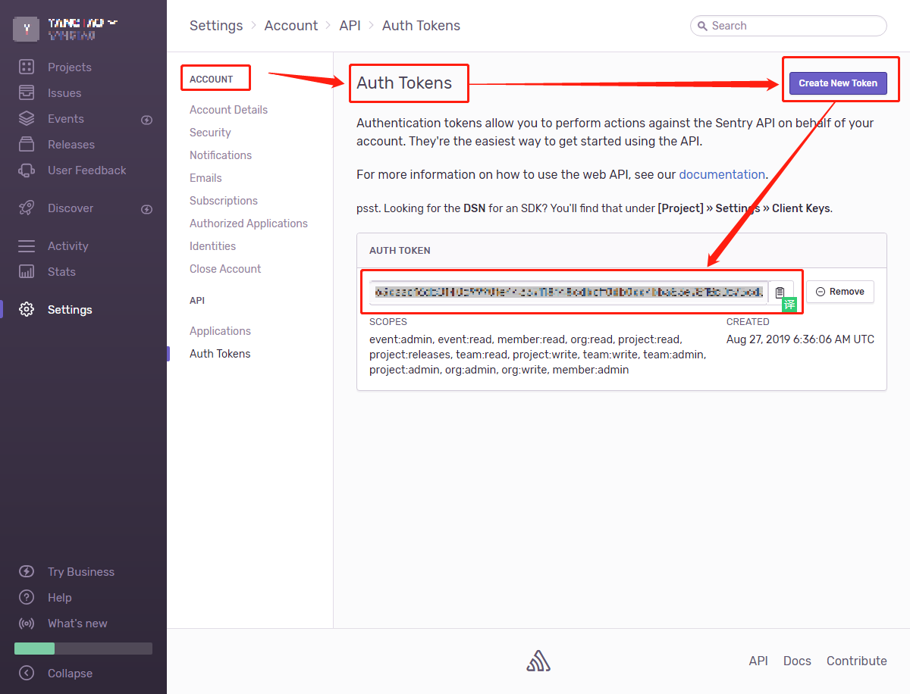

<!-- toc -->
## 前端错误监控
+ 原理
    + 写入前端代码
    window.onerror=function(a,b,c,d,e){(new Image).src=`/m?p=${location.href}&`}
+ 第三方组件——badjs

## 错误日志监控
+ Doc  
[官方git](https://github.com/getsentry)      
[官方git-前端js](https://github.com/getsentry/sentry-javascript)     
[官方api-doc](https://docs.sentry.io/error-reporting/quickstart/?_ga=2.129788364.1746061538.1566874846-1957175966.1566874846&platform=browser)
+ 开始     
https://sentry.io/onboarding/yangtao/get-started/
+ vue+sentry
    + 接入   
    https://docs.sentry.io/platforms/javascript/vue/?_ga=2.131033679.1746061538.1566874846-1957175966.1566874846
    + 开始    
    https://segmentfault.com/a/1190000016309667
+ sentry-后台管理系统  
https://sentry.io/yangtao/yangtao/getting-started/javascript/
+ source map上报sentry
    + auth token创建    
     
    https://sentry.io/settings/account/api/auth-tokens/  
<!-- endtoc -->