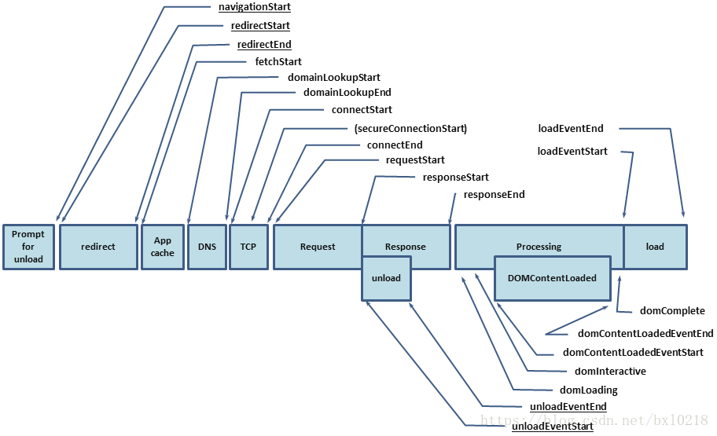
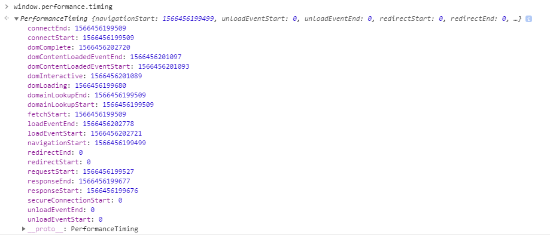
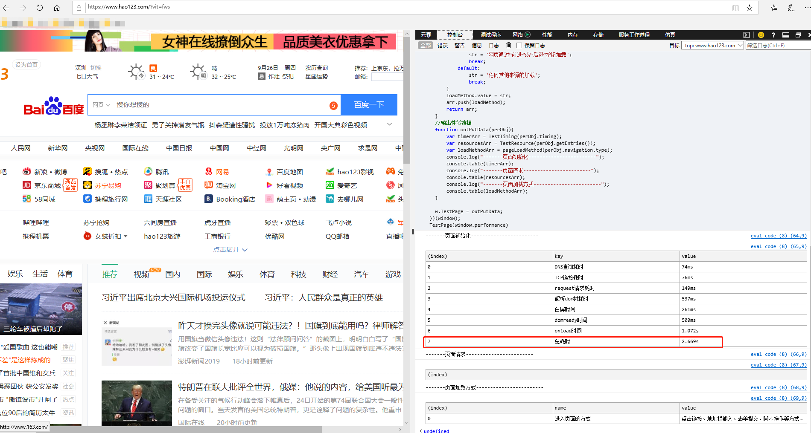
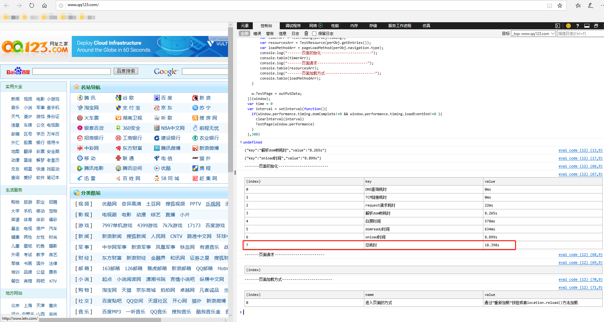
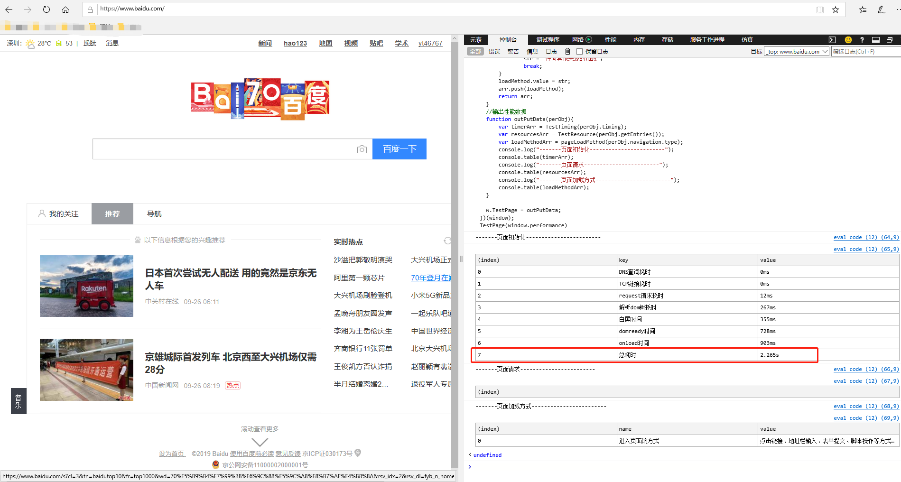
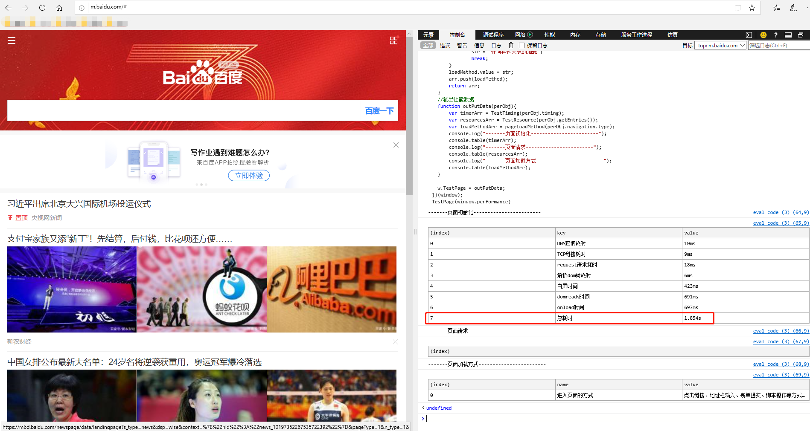

<!-- toc -->
## chrome的控制台/开发者工具
+ 英文  
chrome devtools
+ 源码   
https://github.com/ChromeDevTools
+ 教程文档（中文）     
https://www.html.cn/doc/chrome-devtools/network-performance/resource-loading/       
（英文）    
https://developers.google.cn/web/tools/chrome-devtools/javascript/

+ <B>[Tab]</B> performance monitor（实时性能监控）
[DEMO（官方示例）](https://codepen.io/malyw/pen/QOQvyz  ) 
    + 实时的检测你的CSS性能   
    “Layouts / sec”    
    “Style recalcs / sec”  

    + <span style="color:red;">性能差的样式写法:</span>    
    <span style="display: inline-block;width:20px;"></span>感谢 csstriggers.com，我们知道，改变 CSS 的 top 和 left 属性会触发整个像素渲染流程：绘制，布局和组合。如果我们将这些属性用于动画，它将每秒触发几十次/上百次操作。

    + <span style="color:green;">性能好的样式写法:</span>    
    <span style="display: inline-block;width:20px;"></span>但是如果你使用 CSS 的 transform 属性的 translateX/Y 来切换动画，你将会发现，这并不会触发绘制和布局，仅仅会触发组合这一阶段，因为这是基于 GPU 的，会将你的 CPU 使用率降低为基本为 0%。

## performance    
          
  + 性能数据 
        window.performance.timing
           
  + 性能指标   
      DNS查询耗时 = domainLookupEnd - domainLookupStart   
      TCP链接耗时 = connectEnd - connectStart   
      request请求耗时 = responseEnd - responseStart   
      解析dom树耗时 = domComplete - domInteractive    
      白屏时间 = domloadng - fetchStart   
      domready时间 = domContentLoadedEventEnd - fetchStart    
      onload时间 = loadEventEnd - fetchStart     
  + 总结    
    1.对于网页的测速上报需求，可以通过对Performance.timing对象的属性排列组合，计算出业务需要的测速数据。     
    2.对于网页的性能监测需求，可以通过对Performance.memory对象进行分析，得出内存使用情况等数据。    
    3.对于页面的其他业务监测需求，可以通过Performance提供的其他方法进行灵活使用，计算出业务所需数据     
  + 二、下面标注几个比较重要的统计阶段  
      + 页面加载完成的时间，这几乎代表了用户等待页面可用的时间   
      <span style="display: inline-block;width:20px;"></span>loadPage = loadEventEnd - navigationStart   
      + 解析 DOM 树结构的时间，反省下你的 DOM 树嵌套是不是太多了！   
      <span style="display: inline-block;width:20px;"></span>domReady = domComplete - responseEnd;   
      + 重定向的时间，拒绝重定向！比如，http://fudao.qq.com/ 就不该写成 http://fudao.qq.com   
      <span style="display: inline-block;width:20px;"></span>redirect = redirectEnd - redirectStart;   
      + DNS 查询时间,页面内是不是使用了太多不同的域名导致域名查询的时间太长？   
      <span style="display: inline-block;width:20px;"></span>lookupDomain = domainLookupEnd - domainLookupStart;   
      详见 HTML5 prefetch   
      + 读取页面第一个字节的时间，可以理解为用户拿到你的资源占用的时间，   
      加异地机房了么，加CDN 处理了么？加带宽了么？加 CPU 运算速度了么？   
      <span style="display: inline-block;width:20px;"></span>TTFB 即 Time To First Byte 的意思   
      ttfb = responseStart - navigationStart;    
      + 内容加载完成的时间，页面内容经过 gzip 压缩了么，静态资源 css、js 等压缩   
      <span style="display: inline-block;width:20px;"></span>request = responseEnd - requestStart;        
      + 执行 onload 回调函数的时间
        <span style="display: inline-block;width:20px;"></span>是否太多不必要的操作都放到 onload 回调函数里执行了，考虑过延迟加载、按需加载的策略么？   

        <span style="display: inline-block;width:20px;"></span>loadEvent = loadEventEnd - loadEventStart;   

        + DNS 缓存时间   
        <span style="display: inline-block;width:20px;"></span>appcache = domainLookupStart - fetchStart;     
        + 卸载页面的时间     
        <span style="display: inline-block;width:20px;"></span>times.unloadEvent = unloadEventEnd - unloadEventStart;         
        + TCP 建立连接完成握手的时间     
        <span style="display: inline-block;width:20px;"></span>times.connect = connectEnd - connectStart;   
  + 加载时间
  ```javascript
  // 计算加载时间
  function getPerformanceTiming () {  
      var performance = window.performance;
  
      if (!performance) {
          // 当前浏览器不支持
          console.log('你的浏览器不支持 performance 接口');
          return;
      }
  
      var t = performance.timing;
      var times = {};
  
      //【重要】页面加载完成的时间
      //【原因】这几乎代表了用户等待页面可用的时间
      times.loadPage = t.loadEventEnd - t.navigationStart;
  
      //【重要】解析 DOM 树结构的时间
      //【原因】反省下你的 DOM 树嵌套是不是太多了！
      times.domReady = t.domComplete - t.responseEnd;
  
      //【重要】重定向的时间
      //【原因】拒绝重定向！比如，http://example.com/ 就不该写成 http://example.com
      times.redirect = t.redirectEnd - t.redirectStart;
  
      //【重要】DNS 查询时间
      //【原因】DNS 预加载做了么？页面内是不是使用了太多不同的域名导致域名查询的时间太长？
      // 可使用 HTML5 Prefetch 预查询 DNS ，见：[HTML5 prefetch](http://segmentfault.com/a/1190000000633364)            
      times.lookupDomain = t.domainLookupEnd - t.domainLookupStart;
  
      //【重要】读取页面第一个字节的时间
      //【原因】这可以理解为用户拿到你的资源占用的时间，加异地机房了么，加CDN 处理了么？加带宽了么？加 CPU 运算速度了么？
      // TTFB 即 Time To First Byte 的意思
      // 维基百科：https://en.wikipedia.org/wiki/Time_To_First_Byte
      times.ttfb = t.responseStart - t.navigationStart;
  
      //【重要】内容加载完成的时间
      //【原因】页面内容经过 gzip 压缩了么，静态资源 css/js 等压缩了么？
      times.request = t.responseEnd - t.requestStart;
  
      //【重要】执行 onload 回调函数的时间
      //【原因】是否太多不必要的操作都放到 onload 回调函数里执行了，考虑过延迟加载、按需加载的策略么？
      times.loadEvent = t.loadEventEnd - t.loadEventStart;
  
      // DNS 缓存时间
      times.appcache = t.domainLookupStart - t.fetchStart;
  
      // 卸载页面的时间
      times.unloadEvent = t.unloadEventEnd - t.unloadEventStart;
  
      // TCP 建立连接完成握手的时间
      times.connect = t.connectEnd - t.connectStart;
  
      return times;
  }
  ```
  参考：   
  http://www.alloyteam.com/2015/09/explore-performance/   

## 【重要】表格展示页面加载分析情况
```javascript
  (function(w){
    var resultObj = {};
    //初始化相关
    function UnitConversion(num){
      return num >=1000 ? num/1000 + "s" : num + "ms";
    }
    function TestTiming(timing){
        var timerArr = [];
        var dnsTimer = {key:"DNS查询耗时" , value:UnitConversion(timing.domainLookupEnd - timing.domainLookupStart)};
        var tcpTimer = {key:"TCP链接耗时" , value:UnitConversion(timing.connectEnd - timing.connectStart)};
        var requestTimer = {key:"request请求耗时" , value:UnitConversion(timing.responseEnd - timing.responseStart)};
        var domTimer = {key:"解析dom树耗时" , value:UnitConversion(timing.domComplete - timing.domInteractive)};
        console.log(JSON.stringify(domTimer))
        var pageEmptyTimer = {key:"白屏时间" , value:UnitConversion(timing.responseStart - timing.navigationStart)};
        var domReadyTimer = {key:"domready时间" , value:UnitConversion(timing.domContentLoadedEventEnd - timing.navigationStart)};
        var onloadTimer = {key:"onload时间" , value:UnitConversion(timing.loadEventEnd - timing.navigationStart)};
        console.log(JSON.stringify(onloadTimer))
        var allTimer = {key:"总耗时", value: UnitConversion((timing.domainLookupEnd - timing.domainLookupStart)+(timing.connectEnd - timing.connectStart)+(timing.responseEnd - timing.responseStart)+(timing.domComplete - timing.domInteractive)+(timing.responseStart - timing.navigationStart)+(timing.domContentLoadedEventEnd - timing.navigationStart)+(timing.loadEventEnd - timing.navigationStart))};
 
        timerArr = timerArr.concat(dnsTimer, tcpTimer, requestTimer, domTimer, pageEmptyTimer, domReadyTimer, onloadTimer, allTimer);
        return timerArr;
    }
    //请求的各种资源（js,图片，样式等）
    function TestResource(resourcesObj){
        var resourceArr = [];
        var len = resourcesObj.length;
        for(var i = len - 1;i >0;i--){
            var temp = {};
            var cur = resourcesObj[i];
            temp.key = cur.name;
            temp.resValue = UnitConversion(cur.responseEnd - cur.requestStart);
            temp.conValue = UnitConversion(cur.connectEnd - cur.connectStart);
            resourceArr.push(temp);
        }
        return resourceArr;
    }
    //页面的加载方式
    function pageLoadMethod(type){
        var arr = [];
        var loadMethod = {};
        loadMethod.name = "进入页面的方式";
        var str = "";
        switch(type){
            case 0:
                str = '点击链接、地址栏输入、表单提交、脚本操作等方式加载';
                break;
            case 1:
                str = '通过“重新加载”按钮或者location.reload()方法加载';
                break;
            case 2:
                str = '网页通过“前进”或“后退”按钮加载';
                break;
            default:
                str = '任何其他来源的加载';
                break;
        }
        loadMethod.value = str;
        arr.push(loadMethod);
        return arr;
    }
    //输出性能数据
    function outPutData(perObj){
        var timerArr = TestTiming(perObj.timing);
        var resourcesArr = TestResource(perObj.getEntries());
        var loadMethodArr = pageLoadMethod(perObj.navigation.type);
        console.log("-------页面初始化------------------------");
        console.table(timerArr);
        console.log("-------页面请求------------------------");
        console.table(resourcesArr);
        console.log("-------页面加载方式------------------------");
        console.table(loadMethodArr);
    }
 
    w.TestPage = outPutData;
  })(window);
  var time = 0
  var interval = setInterval(function(){
    if(window.performance.timing.domComplete!=0 && window.performance.timing.loadEventEnd!=0 ){
      clearInterval(interval)
      TestPage(window.performance)
    }
  },300)
```
例子：查找最快的导航页
http://m.uc123.com/


http://www.uc123.com/


https://www.hao123.com/


http://www.qq123.com/


http://www.baidu.com/


http://m.baidu.com/


从数据来看，http://m.uc123.com/夺得头冠，所以我个人把它锁定为所有浏览器的主页

参考
https://blog.csdn.net/lovenjoe/article/details/80260658
  
参考：   
https://blog.csdn.net/bxl0218/article/details/80813699    
<!-- endtoc -->