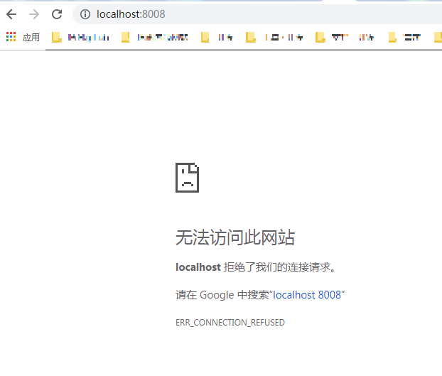

##【问题】Unable to find image 'hello-world  
+ 分析：   
这个时候不要害怕，docker只是还没有下载这个镜像，所以我们重复命令，  
这时我们就会发现，Docker从Docker Hub上获取到最新的Hello World镜像，下载到了本地   
+ 参考：https://blog.csdn.net/CaoMei_HuaCha/article/details/87544109  
+ 解答：  
1. 设置docker的镜像加速：  
+ 阿里（成功）   
https://alzgoonw.mirror.aliyuncs.com    
+ 网易    
http://hub-mirror.c.163.com  
2. 重启电脑，让它生效  
3. docker run hello-world  

## 【问题】启动web容器后，访问不到服务  
  
原因：  
访问ip错了  
解决：  
docker的默认访问IP是：192.168.99.100  

## 【问题】Error response from daemon: driver failed programming external connectivity on endpoint docker-gitlab-master_gitlab_1 (acdb8a1ee5d4d9312e0b78eb4bfd41b94782b83fcd18e2dc5d6f54113854793f): Error starting userland proxy: /forwards/expose/port returned unexpected status: 500  Error: failed to start containers: eb82f7339baf  
原因：  
端口被占用  

解决：  
删除占用端口的进程  

* 查看pid:  
netstat -ano | findstr 10080  
* 杀掉pid:  
taskkill /f /t /fi "pid eq 2536"  
* 根据PID找到相应的应用名称:  
tasklist|findstr  10080  
* 按 进程号 结束进程：  
命令：  
taskkill /pid 3912  
结束多个时，命令：  
taskkill /pid 80 /pid 90  
* 强制终止进程  
taskkill /pid 3912 /f  

参考：  
https://www.cnblogs.com/david-lcw/p/10228829.html  

## 【问题】Only one usage of each socket address (protocol/network address/port) is normally permitted.  
原因：  
这个错误是端口占用导致。  
解决：  
我们应找到此应用程序对应端口号的pid然后kill掉，即可ok  
参考：
https://blog.csdn.net/weixin_38383877/article/details/81202287
后来，发现是window的端口占用了
解决：
## 查看运行的tcp端口及其进程号：
netstat -ano

## 查看进程号对应的程序
netstat -aon|findstr pid

## 杀掉该程序
taskkill /f /t /im com.docker.backend.exe
参考：
https://www.cnblogs.com/micenote/p/6063242.html
