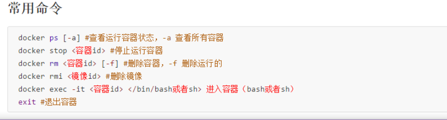
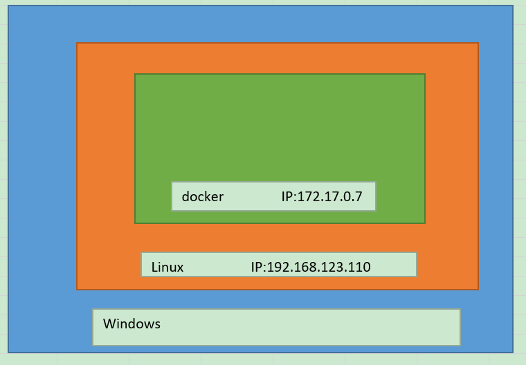

<!-- toc -->  
## Docker  
建立容易迁移环境  

## Docker官网  
https://hub.docker.com/  

## docker.app之preferences全解：  
https://blog.csdn.net/w275840140/article/details/80158972  

## window7的docker  
### 快速启动docker  
+ Step1: 打开cmd  
+ Step2: 拖拽C:\Program Files\Docker Toolbox\start.sh到cmd里，点击enter执行。  

## window的docker配置加速器  
在Docker的配置“Demon”中，在“Registry mirrors”下添加：  
https://registry.docker-cn.com  

备注：  
1）Docker 官方中国区     https://registry.docker-cn.com  
2）网易    http://hub-mirror.c.163.com  
3）ustc     https://docker.mirrors.ustc.edu.cn  

参考：  
https://blog.csdn.net/slibra_L/article/details/77505003  


window docker的加速镜像设置：  
https://segmentfault.com/a/1190000016083023?utm_source=tag-newest  

参考：  
https://segmentfault.com/a/1190000016083023?utm_source=tag-newest  

## 查看镜像  
```  
Docker ps -a  
```  

## 启动镜像  
docker start 镜像id  
参考：  
https://www.cnblogs.com/asxf/p/11057638.html  

## 阿里云镜像加速  
参考：  
控制台  
https://cr.console.aliyun.com/cn-hangzhou/instances/mirrors  
教程  
https://blog.csdn.net/my__holiday/article/details/79111397  

## docker安装的系统  
linux  

## docker-compose用法  

## Docker 运行时资源限制-内存memory、交换机分区Swap、CPU  

## docker常用命令  
  

## 镜像随docker容器启动而自动启动  
--restart=unless-stopped  
或  
restart=always  

方法一：  
docker run -d --restart=unless-stopped -p 3306:3306 hub.c.163.com/library/mysql:5.7.18  
在-d 后添加--restart=unless-stopped下次docker启动后，mysql就会自动启动  
方法二：  
docker container update --restart=always a7328ec41e91  
方法三：
docker run --name docker-gitlab-master_gitlab_1 -d --restart=always /bin/bash
方法四：
docker exec -it docker-gitlab-master_gitlab_1 -d --restart=always /bin/bash

参考：  
https://blog.csdn.net/qq_38522268/article/details/83894903  
https://www.cnblogs.com/kaishirenshi/p/10396446.html  

## docker的ip：
https://jingyan.baidu.com/article/95c9d20d61bc1dec4f756156.html

# 介绍
1、Docker CLI 客户端，用来运行docker引擎创建镜像和容器
2、Docker Machine. 可以让你在windows的命令行中运行docker引擎命令
3、Docker Compose. 用来运行docker-compose命令
4、Kitematic. 这是Docker的GUI版本
5、Docker QuickStart shell. 这是一个已经配置好Docker的命令行环境
6、Oracle VM Virtualbox. 虚拟机

仓库相关操作
docker pull     #从远程仓库拉取镜像到本地
docker push     #推送本地镜像到远程仓库
docker search   #在仓库搜索镜像
docker login    #登录到官方仓库Docker Hub
docker logout   #退出登录
12345
镜像相关操作
docker build    #从Dockerfile构建镜像
docker pull     #同上
docker push     #同上
docker history  #显示镜像的历史信息
docker images   #列出镜像
docker rmi      #删除镜像
docker tag      #给镜像打上tag标签
docker run      #创建容器并启动容器
docker create   #创建容器
docker commit   #将修改后的容器生成镜像
docker load     #从压缩包中加载镜像
docker import   #从归档文件中创建镜像
docker save     #将镜像保存到压缩文件
12345678910111213
容器相关操作
docker attach   #依附到一个正在运行的容器中
docker exec     #进到正在运行的容器中执行命令
docker cp       #在容器和本地系统间复制文件
docker update   #将一个容器内所有的进程从暂停状态中恢复
docker ps       #列出主机中的容器
docker port     #查找一个nat到私有网口的公共口
docker top      #查看一个容器中正在运行的进程信息
docker logs     #查看日志文件
docker diff     #检查容器内文件系统的修改
docker status   #输出容器的资源使用统计信息
docker wait     #阻塞直到容器终止
docker start    #启动已创建的容器
docker pause    #暂停运行中的容器
docker unpause  #使暂停的容器恢复运行
docker stop     #停止容器运行
docker rename   #容器改名
docker restart  #容器重启
docker kill     #关闭运行中的容器
docker rm       #删除容器
docker export   #导出容器内容为tar包
docker run      #同上
docker create   #同上
docker commit   #同上
1234567891011121314151617181920212223
其他基本命令
docker events   #从服务端获取实时的事件
docker info     #查看系统相关信息
docker inspect  #显示Docker对象的具体配置信息，包括容器，镜像，网络等
docker version  #输出Docker的版本信息
1234
管理命令
docker container    #容器管理
docker image        #镜像管理
docker network      #网络管理
docker node         #节点管理
docker plugin       #插件管理
docker secret       #管理敏感数据及普通服务配置项
docker service      #服务管理
docker stack        #栈管理
docker swarm        #集群管理
docker system       #管理系统信息
docker volume       #卷管理

参考：
https://blog.csdn.net/xhyxxx/article/details/75447962

## docker 设置代理vpn
https://www.cnblogs.com/jacquin/p/9604576.html

## ssh连接docker container
https://www.cnblogs.com/linguoguo/p/10248074.html

真实原理：
在Windows上搭建docker服务器需要在Windows模拟一个Linux平台，然后在Linux平台上搭建的docker服务器，所以在使用ssh工具连接docker容器的时候，使用的ip地址不是docker容器的地址，也不能使用localhost、127.0.0.1，需要使用 docker-mechine IP default命令获取到虚拟Linux的IP地址，通过这个地址使用 ssh -p xxx root@192.168.100.0（此地址是通过命令获取到的IP），然后才能登录。使用xshell登录docker容器后，利用xftp连接进行文件的传送

图解：

参考：
https://www.cnblogs.com/lanrumeng/p/9764013.html
https://www.cnblogs.com/qingyunzong/p/9021140.html
<!-- endtoc -->  

docker exec -it a7328ec41e91  update-permissions

## 大杀器docker-compose的特殊命令：
build 构建或重建服务
help 命令帮助
kill 杀掉容器
logs 显示容器的输出内容
port 打印绑定的开放端口
ps 显示容器
pull 拉取服务镜像
restart 重启服务
rm 删除停止的容器
run 运行一个一次性命令
scale 设置服务的容器数目
start 开启服务
stop 停止服务
up 创建并启动容器

参考：
https://www.cnblogs.com/williamjie/p/9103327.html

## window的docker连接ssh
安装openssh-server
https://www.v2ex.com/t/468079
安装ubuntu镜像，实现bash命令
https://blog.51cto.com/6226001001/1953310
https://www.cnblogs.com/xingyunfashi/p/8857093.html

## docker run
创建一个新的容器并运行一个命令