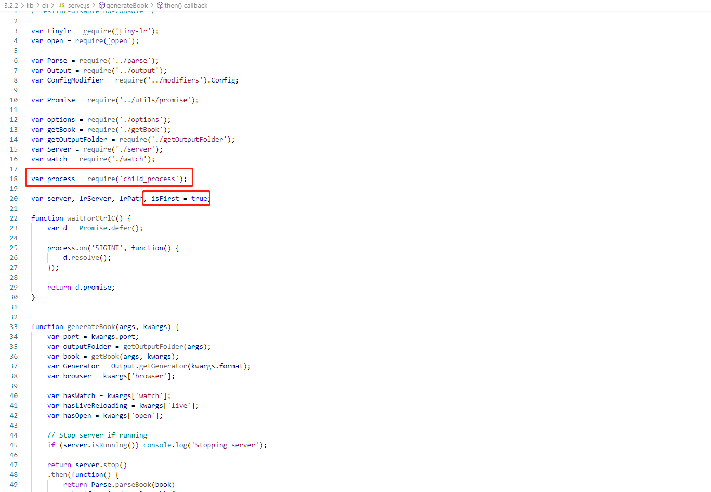
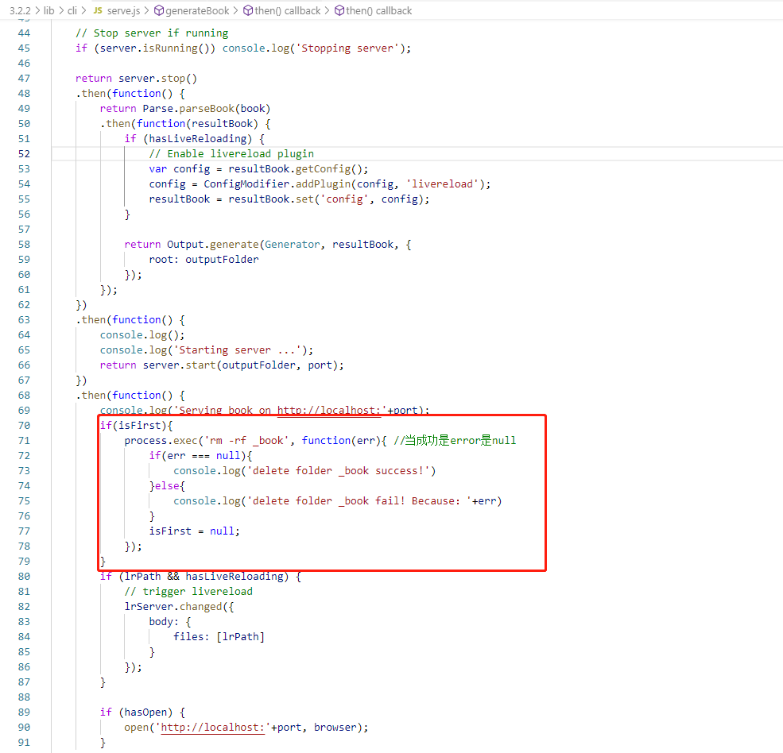
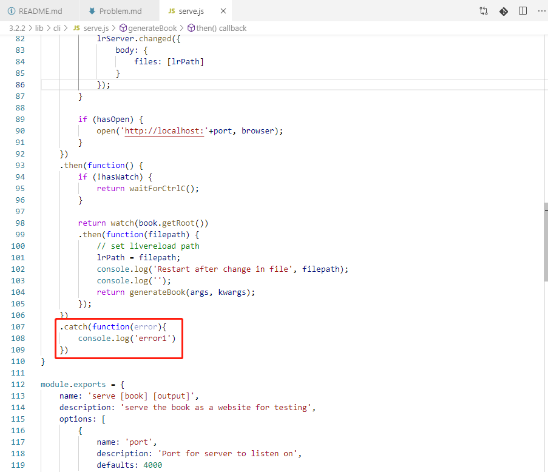
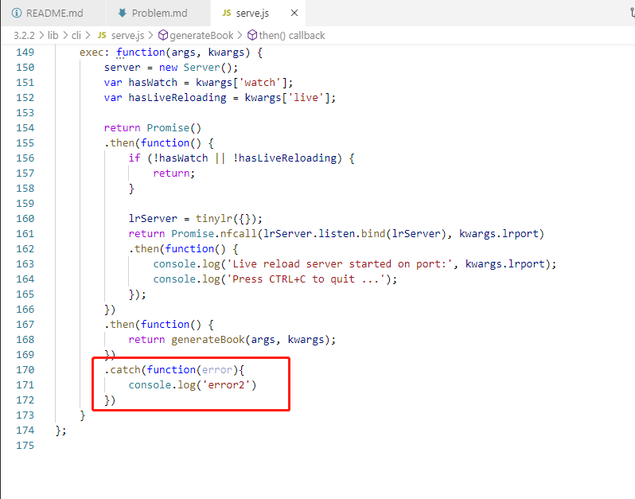
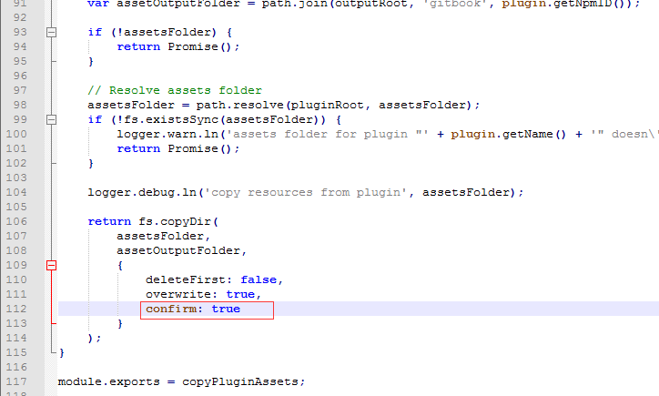

## windows 系统 GitBook生成PDF、epub报错Error during ebook generation: 'ebook-convert' 乱码  
解决：  
https://www.cnblogs.com/gobyte/p/10953081.html  

## gitbook导出的pdf不显示图片  
解决：  
把图片放到文件的当前文件夹里，用./引入  

## gitbook serve 在window热加载失败的解决办法：  
（1）修改文件：C:\Users\tobeyang\.gitbook\versions\3.2.2\lib\cli\serve.js  
(家里电脑的路径)C:\Users\ASUS\.gitbook\versions\3.2.3\lib\cli\serve.js
  
  
实现：第一次启动成功后，删除_book文件夹
解决：重新编译，权限不通过。 
增加代码：
```
var process = require('child_process');
var isFirst = true;
```
```
if(isFirst){
    process.exec('rm -rf _book', function(err){ //当成功时，error是null
        if(err === null){
            console.log('delete folder _book success!');
        }else{
            console.log('delete folder _book fail!Because: ' + err);
        }
        isFirst = null;
    });
}
```

增加异常捕获
  
  
解决：新增文件时，编译权限不通过
增加代码：
```
.catch(function(error1){
    console.log(error1);
});
```

```
.catch(function(error2){
    console.log(error2);
});
```

（2）修改文件：C:\Users\tobeyang\.gitbook\versions\3.2.2\lib\output\website\copyPluginAssets.js  
(家里电脑的路径)C:\Users\ASUS\.gitbook\versions\3.2.3\lib\output\website\copyPluginAssets.js
  
将 confirm: true 改为 confirm: false  
解决：复制粘贴内容，实现热加载  
（3）md文件不能为空，否则编译失败。

## [Error: EPERM: operation not permitted, open 'f:\My\GitBook\my-gitbook\_book\LIFE\VPN\README.md'] {
  errno: -4048,
  code: 'EPERM',
  syscall: 'open',
  path: 'f:\\My\\GitBook\\my-gitbook\\_book\\LIFE\\VPN\\README.md'
}
解决办法：
md文件不能为空，既可解决！

## 去掉或者隐藏“Published with Gitbook”/“本书使用 GitBook 发布”
https://www.itsvse.com/thread-5819-1-1.html