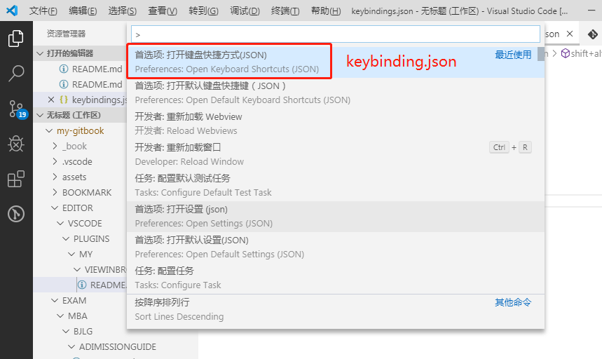
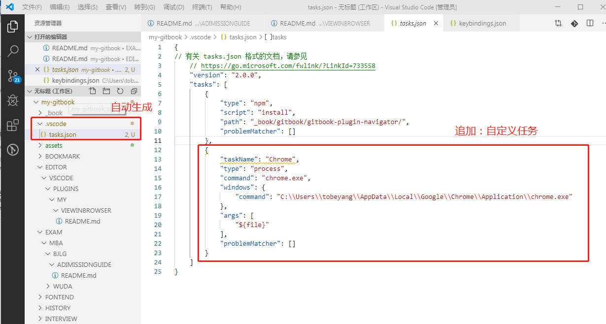

<!-- toc -->
## view in browser(支持所有文件在浏览器预览)
+ ### step1: 设置vscode快捷键   
keybinding.json:   
   
+ ### step2: 设置vscode任务（configure task）   
项目在vscode打开时，会自动生成.vscode文件夹（包含tasks.json）
```json
{
    "taskName": "Chrome",
    "type":"process",
    "command": "chrome.exe",
    "windows": {
        "command": "C:\\Users\\ASUS\\AppData\\Local\\Google\\Chrome\\Application\\chrome.exe"
    },
    "args": [
        "${file}"
    ],
    "problemMatcher": []
}
```
 
+ ### step3: 触发自定义插件
ctrl+shift+t
<!-- endtoc -->