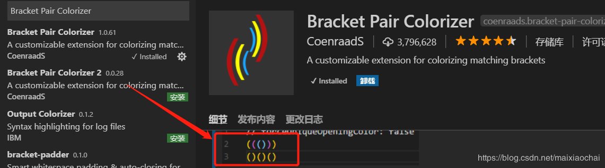

## Document This
javascript的快速注释

    优秀的代码除了优秀的性能、规范的格式，注释也是不可或缺的，而且注释也应该有一套标准的注释方法，特别对于 JavaScript 这种语言。
    Document This 可以快速地帮你生成注释，如一些函数的注释还能帮你抽取出参数的定义等，是你编写规范代码必备的工具。

## ESLint
    ESLint 是一个语法规则和代码风格的检查工具，可以用来保证写出语法正确、风格统一的代码。
    而 VSCode 中的 ESLint 插件就直接将 ESLint 的功能集成好，安装后即可使用，对于代码格式与规范的细节还可以自定义，并且一个团队可以共享同一个配置文件，这样一个团队所有人写出的代码就可以使用同一个代码规范，在代码签入前每个人可以完成自己的代码规范检查。

## Beautify
    Beautify 插件可以快速格式化你的代码格式，让你在编写代码时杂乱的代码结构瞬间变得非常规整，代码强迫症必备，较好的代码格式在后期维护以及他人阅读时都会有很多的便利。
    插件支持的语言非常多，基本堵盖了目前所有的语言，而且你还可以自定义代码格式化的结构。

## vetur
vue语法高亮、智能感知、Emmet等

## Bracket Pair Colorizer
成对的彩色括号

## 参考
https://www.cnblogs.com/zhaoshujie/p/9834654.html