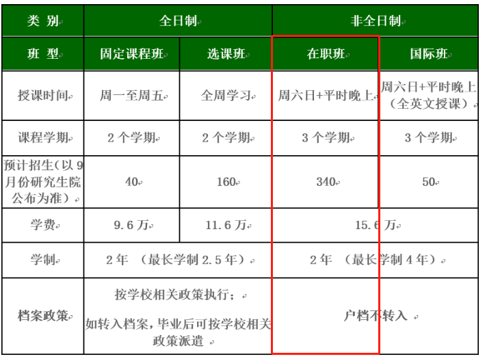

<!-- toc -->
## 招生简章：  
http://pdc.bit.edu.cn/MBA/zsjz/120187.htm  

## 考试流程  
### 网上报名：  
&nbsp;2019年10月中下旬，考生须在研招网（http://yz.chsi.com.cn/）进行网上报名（学历查验），网上支付报名费。  
### 现场确认：  
&nbsp;2019年11月中旬，考生携带本人有效证件、毕业证原件，进行照片采集及现场验证。  
&nbsp;未通过学历校验考生，需携带学历认证报告等文件。  
&nbsp;打印准考证：2019年12月中下旬  
### 初试  
&nbsp;初试时间: 2019年12月底   （具体时间以教育部文件规定为准）  
&nbsp;初试科目：综合能力（数学、逻辑、写作），英语  
&nbsp;初试方式：统一笔试，参加工商管理硕士（MBA）全国联考  
### 复试  
&nbsp;复试科目：综合素质面试、政治笔试、 英语口语、听力测试  
&nbsp;复试时间：&nbsp;2020年3月中旬，3月下旬出复试结果（具体时间以我校专业学位教育联合中心通知为准）  
### ※ 不接受非第一志愿考生调剂  

## 北京理工在职班的授课方式  
  

## 沟通
+ 电话咨询：
86-10-68945687，68918820
+ 微信平台：
BIT-PDC
+ MBA联合会公众号：
MBABIT
+ 官方QQ备考群：
662683401

## 参考：  
+ 全文：http://pdc.bit.edu.cn/MBA/zsjz/120187.htm  
<!-- endtoc -->