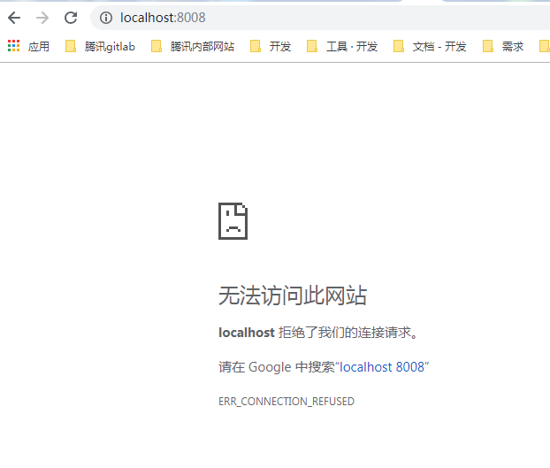

##【问题】Unable to find image 'hello-world  
+ 分析：   
这个时候不要害怕，docker只是还没有下载这个镜像，所以我们重复命令，  
这时我们就会发现，Docker从Docker Hub上获取到最新的Hello World镜像，下载到了本地   
+ 参考：https://blog.csdn.net/CaoMei_HuaCha/article/details/87544109  
+ 解答：  
1. 设置docker的镜像加速：  
+ 阿里（成功）   
https://alzgoonw.mirror.aliyuncs.com    
+ 网易    
http://hub-mirror.c.163.com  
2. 重启电脑，让它生效  
3. docker run hello-world  

## 【问题】启动web容器后，访问不到服务
  
原因：
访问ip错了
解决：  
docker的默认访问IP是：192.168.99.100  
